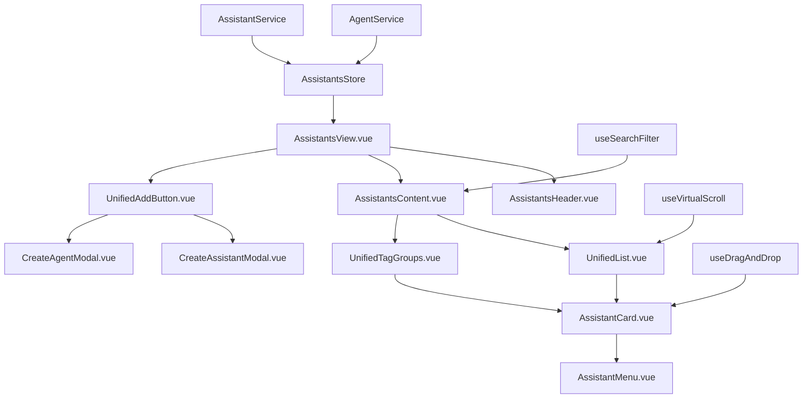

# Design Document

## Overview

基于 Cherry Studio 的设计理念，为 FactoryOS 实现助手和智能体管理系统。该系统将采用 Vue 3 + TypeScript + Ant Design Vue 技术栈，实现卡片式布局、拖拽排序、分组管理等核心功能，并通过 Dify API 集成实现智能体的工作流能力。

系统架构分为三层：UI 层负责交互展示，状态管理层负责数据流，服务层负责 API 通信和业务逻辑。

## Steering Document Alignment

### Technical Standards (tech.md)

- **Vue 3 Composition API**: 使用组合式 API 和响应式系统
- **TypeScript 严格模式**: 确保类型安全和代码质量
- **Ant Design Vue 组件**: 保持与项目 UI 框架的一致性
- **Pinia 状态管理**: 集成项目现有的状态管理方案

### Project Structure (structure.md)

- **组件模块化**: 在 `apps/web-antd/src/views/ai-assistants/` 下创建功能模块
- **工具函数复用**: 利用 `packages/utils` 中的现有工具
- **类型定义扩展**: 在 `packages/types` 中扩展相关类型
- **样式系统**: 使用项目现有的 Tailwind CSS 配置

## Code Reuse Analysis

### Existing Components to Leverage

- **@core/ui-kit**: 使用现有的卡片、列表、弹窗等基础组件
- **effects/layouts**: 利用布局组件实现页面结构
- **utils/validation**: 复用表单验证工具函数
- **stores/common**: 使用通用的状态管理模式

### Integration Points

- **路由系统**: 集成到现有的 Vue Router 配置
- **权限系统**: 使用 effects/access 进行权限控制
- **主题系统**: 利用项目主题系统保持视觉一致性
- **国际化**: 使用 locales 包实现多语言支持

## Architecture

采用组件化、模块化的设计架构，确保代码的可维护性和可扩展性。

### Modular Design Principles

- **Single File Responsibility**: 每个组件文件专注单一功能(列表、卡片、弹窗等)
- **Component Isolation**: 创建小而专注的组件而非大型单体文件
- **Service Layer Separation**: 分离数据访问、业务逻辑和展示层
- **Utility Modularity**: 将工具函数分解为专注的单一用途模块



## Components and Interfaces

### Component 1: AssistantsView.vue

- **Purpose:** 主视图组件，协调所有子组件
- **Interfaces:** 提供统一的助手/智能体管理界面
- **Dependencies:** AssistantsStore, 各种子组件
- **Reuses:** layouts/Page.vue, @core/ui-kit components

### Component 2: AssistantCard.vue

- **Purpose:** 单个助手/智能体卡片展示
- **Interfaces:** 支持拖拽、右键菜单、状态显示
- **Dependencies:** useDragAndDrop, AssistantMenu
- **Reuses:** @core/ui-kit/Card.vue, icons packages

### Component 3: UnifiedList.vue & UnifiedTagGroups.vue

- **Purpose:** 列表视图和分组视图的容器组件
- **Interfaces:** 提供不同的布局模式
- **Dependencies:** AssistantCard, useVirtualScroll
- **Reuses:** @core/ui-kit/List.vue, virtual scroll utilities

### Component 4: CreateAssistantModal.vue & CreateAgentModal.vue

- **Purpose:** 创建助手和智能体的弹窗组件
- **Interfaces:** 表单验证、API 连接测试
- **Dependencies:** AssistantService, AgentService
- **Reuses:** @core/ui-kit/Modal.vue, form validation

## Data Models

### Assistant Model

```typescript
interface Assistant {
  id: string;
  name: string;
  type: 'assistant' | 'agent';
  avatar?: string;
  description?: string;
  tags: string[];
  groupId?: string;
  settings: AssistantSettings;
  createdAt: Date;
  updatedAt: Date;
  sortOrder: number;
}

interface AssistantSettings {
  model: string;
  temperature: number;
  maxTokens: number;
  systemPrompt?: string;
  knowledgeBases?: string[];
}
```

### Agent Model

```typescript
interface Agent extends Assistant {
  type: 'agent';
  difyConfig: DifyConfig;
  status: 'online' | 'offline' | 'error';
  lastHealthCheck?: Date;
}

interface DifyConfig {
  apiUrl: string;
  apiKey: string;
  workflowId?: string;
  timeout: number;
}
```

### Group Model

```typescript
interface Group {
  id: string;
  name: string;
  color?: string;
  collapsed: boolean;
  sortOrder: number;
  createdAt: Date;
}
```

## Error Handling

### Error Scenarios

1. **API 连接失败**:
   - **Handling:** 显示错误状态，提供重试按钮，本地缓存上次成功状态
   - **User Impact:** 智能体显示离线状态，基础功能仍可用

2. **拖拽操作失败**:
   - **Handling:** 回退到原始位置，显示错误提示
   - **User Impact:** 视觉反馈动画，保持数据一致性

3. **表单验证失败**:
   - **Handling:** 实时验证反馈，高亮错误字段
   - **User Impact:** 阻止提交，显示具体错误信息

4. **数据同步失败**:
   - **Handling:** 本地状态优先，后台重试同步
   - **User Impact:** 显示同步状态图标，允许手动重试

## Testing Strategy

### Unit Testing

- **组件测试**: 使用 Vitest 测试每个组件的渲染和交互
- **工具函数测试**: 测试拖拽、搜索、过滤等核心逻辑
- **Store 测试**: 验证状态管理的正确性和响应性
- **服务测试**: Mock API 测试服务层的业务逻辑

### Integration Testing

- **API 集成**: 测试与 Dify API 的集成和数据流
- **组件集成**: 测试组件间的数据传递和事件处理
- **状态同步**: 测试本地状态与服务器状态的同步
- **拖拽流程**: 测试完整的拖拽排序和分组流程

### End-to-End Testing

- **用户创建流程**: 从创建到使用的完整用户旅程
- **拖拽分组**: 复杂的拖拽分组操作测试
- **搜索筛选**: 各种搜索和筛选组合的功能测试
- **错误恢复**: 网络错误等异常情况的处理测试
