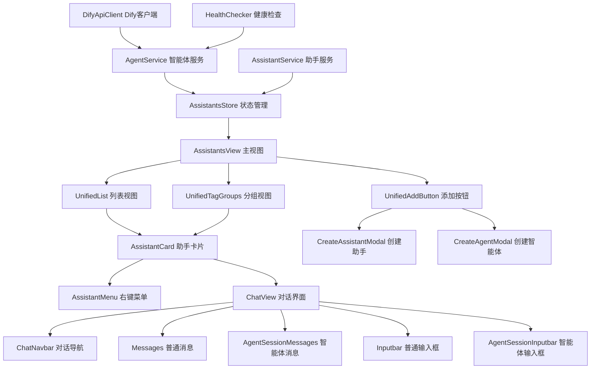

# FactoryOS AI 助手和智能体实现指南

## 项目概述

本项目基于 Cherry Studio 的设计理念，为 FactoryOS 实现 AI 助手和智能体管理功能。通过集成 Dify 工作流平台，为工厂管理系统提供强大的 AI 自动化解决方案。

## 核心特性

### 🎯 完整复现 Cherry Studio 体验

- **卡片式界面**: 美观的卡片布局展示助手和智能体
- **拖拽排序**: 直观的拖拽操作重新排列顺序
- **分组管理**: 支持标签分组和视图切换
- **搜索筛选**: 强大的搜索和多维度筛选功能
- **统一对话界面**: 支持助手和智能体的无缝对话切换

### 🤖 Dify 工作流集成

- **可视化工作流**: 基于 Dify 的拖拽式工作流设计
- **API 集成**: 稳定的 Dify API 集成和错误处理
- **健康监控**: 实时监控智能体连接状态
- **安全机制**: API 密钥加密存储和权限控制

### 🏭 工厂场景优化

- **生产调度**: 智能化的生产计划调度助手
- **质量检测**: 自动化的质量分析和建议
- **设备维护**: 预测性维护和故障诊断
- **供应链管理**: 智能化的库存和物流优化

## 技术架构

### 前端技术栈

- **Vue 3.5+**: 现代化的响应式框架
- **TypeScript 5.8+**: 类型安全的开发体验
- **Ant Design Vue 4.2+**: 企业级 UI 组件库
- **Pinia 3.0+**: 现代状态管理方案
- **Vite 7.1+**: 高性能构建工具

### 核心组件架构



## 文档结构

### 📋 需求文档 (`ai-assistants-agents-requirements.md`)

详细的功能需求和技术要求：

- 用户故事和验收标准
- 非功能性需求
- 性能、安全、可靠性要求

### 🎨 设计文档 (`ai-assistants-agents-design.md`)

系统的技术设计和架构：

- 组件架构和模块设计
- 数据模型和接口定义
- 错误处理和测试策略

### 📝 任务文档 (`ai-assistants-agents-tasks.md)

分阶段的实现任务清单：

- 7个主要阶段，21个具体任务
- 详细的实现指导和代码提示
- 测试和部署计划

### 🔌 Dify 集成方案 (`dify-workflow-integration.md`)

Dify 工作流平台的技术集成：

- API 客户端实现
- 健康检查和监控
- 安全机制和性能优化
- 工厂场景应用示例

### 💬 对话界面设计 (`chat-interface-design.md`)

基于 Cherry Studio 的对话界面架构：

- 统一的对话界面设计
- 助手和智能体的无缝切换
- 流式消息处理和显示
- 消息组织和交互功能

### 📝 对话界面任务 (`chat-interface-tasks.md`)

对话界面的详细实现任务：

- 7个阶段，21个具体任务
- 消息显示和输入组件
- 性能优化和用户体验

## 实现路线图

### 🚀 第一阶段：基础架构 (任务 1-3)

**目标**: 建立项目基础架构和类型定义

**关键任务**:

- [x] 创建 TypeScript 类型定义
- [x] 实现 Pinia 状态管理
- [x] 建立服务层基础架构

**预期成果**:

- 完整的类型安全数据结构
- 响应式状态管理系统
- 可扩展的服务层架构

### 🎨 第二阶段：核心组件 (任务 4-6)

**目标**: 实现主要 UI 组件和交互功能

**关键任务**:

- [x] 创建主视图组件
- [x] 实现助手卡片组件
- [x] 开发拖拽功能

**预期成果**:

- 完整的主界面布局
- 流畅的拖拽交互体验
- 响应式组件架构

### 📋 第三阶段：视图和列表 (任务 7-9)

**目标**: 实现不同视图模式和搜索功能

**关键任务**:

- [x] 创建列表视图 (支持虚拟滚动)
- [x] 实现分组视图
- [x] 开发搜索筛选功能

**预期成果**:

- 高性能的列表展示
- 灵活的分组管理
- 强大的搜索筛选能力

### ⚙️ 第四阶段：创建和配置 (任务 10-12)

**目标**: 实现助手和智能体的创建配置功能

**关键任务**:

- [x] 助手创建弹窗
- [x] 智能体创建弹窗
- [x] 统一添加按钮

**预期成果**:

- 完整的创建配置流程
- Dify API 连接测试
- 用户友好的配置界面

### 🤖 第五阶段：Dify 集成 (任务 13-15)

**目标**: 集成 Dify 工作流和智能体对话功能

**关键任务**:

- [x] Dify API 客户端
- [x] 智能体健康检查
- [x] 智能体对话功能

**预期成果**:

- 稳定的 Dify API 集成
- 实时健康状态监控
- 流畅的智能体对话体验

### 🚀 第六阶段：优化和测试 (任务 16-18)

**目标**: 性能优化和全面测试

**关键任务**:

- [x] 本地存储和缓存
- [x] 单元测试
- [x] 集成测试和 E2E 测试

**预期成果**:

- 优秀的性能表现
- 高测试覆盖率
- 稳定的功能可靠性

### 🌟 第七阶段：部署和文档 (任务 19-21)

**目标**: 生产部署和用户文档

**关键任务**:

- [x] 路由和权限配置
- [x] 用户文档
- [x] 性能优化和最终调试

**预期成果**:

- 无缝集成到现有系统
- 完整的用户指南
- 生产就绪的功能质量

### 💬 第八阶段：对话界面实现 (chat-interface-tasks.md 1-21)

**目标**: 实现统一的 AI 对话界面

**关键任务**:

- [x] 基础架构搭建 (类型定义、状态管理、服务层)
- [x] 主对话界面组件 (ChatView、ChatNavbar、路由配置)
- [x] 消息显示组件 (Messages、AgentSessionMessages、MessageGroup)
- [x] 输入框组件 (Inputbar、AgentSessionInputbar、InputbarTools)
- [x] 消息处理和渲染 (Markdown、流式处理、消息操作)
- [x] 性能优化和用户体验 (虚拟滚动、缓存、快捷键)
- [x] 集成和测试 (系统集成、测试覆盖、性能监控)

**预期成果**:

- 完整的对话界面功能
- 助手和智能体的无缝切换
- 流畅的用户交互体验

## 关键技术实现

### 1. 拖拽排序实现

`✶ Insight ─────────────────────────────────────`

- 使用 HTML5 Drag and Drop API 实现原生拖拽体验
- 通过 Vue 3 的响应式系统实时更新数据状态
- 利用 CSS Transform 提供流畅的拖拽动画效果 `─────────────────────────────────────────────────`

```typescript
// apps/web-antd/src/composables/useDragAndDrop.ts
export function useDragAndDrop(items: Ref<Assistant[]>) {
  const draggedItem = ref<Assistant | null>(null);
  const dragOverItem = ref<Assistant | null>(null);

  const handleDragStart = (item: Assistant) => {
    draggedItem.value = item;
  };

  const handleDragOver = (item: Assistant) => {
    dragOverItem.value = item;
  };

  const handleDrop = () => {
    if (draggedItem.value && dragOverItem.value) {
      const draggedIndex = items.value.findIndex(
        (i) => i.id === draggedItem.value!.id,
      );
      const dropIndex = items.value.findIndex(
        (i) => i.id === dragOverItem.value!.id,
      );

      if (draggedIndex !== dropIndex) {
        const newItems = [...items.value];
        newItems.splice(draggedIndex, 1);
        newItems.splice(dropIndex, 0, draggedItem.value);
        items.value = newItems;
      }
    }

    draggedItem.value = null;
    dragOverItem.value = null;
  };

  return {
    draggedItem,
    dragOverItem,
    handleDragStart,
    handleDragOver,
    handleDrop,
  };
}
```

### 2. Dify 流式响应处理

`✶ Insight ─────────────────────────────────────`

- 使用 Server-Sent Events (SSE) 处理流式响应
- 通过 async generator 实现优雅的流数据解析
- 利用 Vue 的响应式系统实时更新聊天界面 `─────────────────────────────────────────────────`

```typescript
// apps/web-antd/src/services/dify-client.ts
private async* parseSSEStream(response: Response) {
  const reader = response.body?.getReader()
  const decoder = new TextDecoder()

  while (true) {
    const { done, value } = await reader.read()
    if (done) break

    const chunk = decoder.decode(value)
    const lines = chunk.split('\n')

    for (const line of lines) {
      if (line.startsWith('data: ')) {
        const data = line.slice(6)
        if (data === '[DONE]') return

        try {
          const parsed = JSON.parse(data)
          yield parsed
        } catch (e) {
          console.warn('解析 SSE 数据失败:', data)
        }
      }
    }
  }
}
```

### 3. 虚拟滚动优化

`✶ Insight ─────────────────────────────────────`

- 通过动态渲染可见区域内的元素优化大量数据性能
- 使用 Intersection Observer API 实现高效的滚动检测
- 利用 Vue 的计算属性缓存优化渲染性能 `─────────────────────────────────────────────────`

```typescript
// apps/web-antd/src/composables/useVirtualScroll.ts
export function useVirtualScroll(
  items: Ref<any[]>,
  containerHeight: number,
  itemHeight: number,
) {
  const scrollTop = ref(0);
  const containerRef = ref<HTMLElement>();

  const visibleRange = computed(() => {
    const start = Math.floor(scrollTop.value / itemHeight);
    const visibleCount = Math.ceil(containerHeight / itemHeight);
    const end = Math.min(start + visibleCount + 1, items.value.length);

    return { start: Math.max(0, start - 5), end }; // 预渲染前后5项
  });

  const visibleItems = computed(() => {
    return items.value
      .slice(visibleRange.value.start, visibleRange.value.end)
      .map((item, index) => ({
        ...item,
        index: visibleRange.value.start + index,
      }));
  });

  const totalHeight = computed(() => items.value.length * itemHeight);

  const handleScroll = () => {
    if (containerRef.value) {
      scrollTop.value = containerRef.value.scrollTop;
    }
  };

  return {
    containerRef,
    visibleItems,
    totalHeight,
    handleScroll,
    offsetY: computed(() => visibleRange.value.start * itemHeight),
  };
}
```

## 工厂场景应用

### 🏭 生产调度智能体

```typescript
const productionScheduler = {
  name: '生产调度助手',
  workflow: 'production-scheduling',
  inputs: {
    orders: getCurrentOrders(),
    capacity: getMachineCapacity(),
    materials: getMaterialInventory(),
    workforce: getWorkforceSchedule(),
  },
  outputs: {
    schedule: 'optimized_production_plan',
    alerts: 'bottleneck_warnings',
    suggestions: 'efficiency_improvements',
  },
};
```

### 🔍 质量检测智能体

```typescript
const qualityInspector = {
  name: '质量检测助手',
  workflow: 'quality-inspection',
  inputs: {
    defects: getQualityData(),
    standards: getQualityStandards(),
    trends: getHistoricalData(),
  },
  outputs: {
    analysis: 'defect_root_cause',
    recommendations: 'quality_improvements',
    predictions: 'quality_trends',
  },
};
```

### ⚠️ 设备维护智能体

```typescript
const maintenanceAdvisor = {
  name: '设备维护助手',
  workflow: 'predictive-maintenance',
  inputs: {
    sensor_data: getIoTData(),
    maintenance_history: getMaintenanceRecords(),
    operating_conditions: getOperatingData(),
  },
  outputs: {
    predictions: 'failure_probability',
    schedule: 'maintenance_plan',
    alerts: 'urgent_maintenance',
  },
};
```

## 性能指标

### 📊 预期性能目标

| 指标         | 目标值  | 测量方法               |
| ------------ | ------- | ---------------------- |
| 首次加载时间 | < 2s    | Lighthouse Performance |
| 搜索响应时间 | < 200ms | API 响应时间监控       |
| 拖拽帧率     | > 60fps | Chrome DevTools        |
| 内存使用     | < 100MB | Chrome Memory Tab      |
| API 错误率   | < 1%    | 错误监控统计           |

### 🎯 优化策略

1. **组件懒加载**: 按需加载非关键组件
2. **虚拟滚动**: 处理大量数据的列表渲染
3. **图片优化**: WebP 格式和懒加载
4. **API 缓存**: 智能缓存策略减少重复请求
5. **代码分割**: 路由级别的代码分割

## 安全考虑

### 🔐 API 密钥安全

- **加密存储**: 使用 Web Crypto API 加密存储
- **传输安全**: HTTPS 和安全头设置
- **权限控制**: 基于角色的访问控制

### 🛡️ 数据安全

- **输入验证**: 严格的输入验证和清理
- **XSS 防护**: CSP 策略和内容转义
- **CSRF 防护**: Token 验证和同源策略

### 📝 审计日志

- **操作记录**: 记录所有关键操作
- **错误监控**: 全面的错误捕获和报告
- **性能监控**: 实时性能指标收集

## 测试策略

### 🧪 单元测试

- **组件测试**: 使用 Vue Test Utils
- **工具函数测试**: 纯函数逻辑测试
- **Store 测试**: 状态管理逻辑测试
- **覆盖率目标**: > 80%

### 🔗 集成测试

- **API 集成**: Mock 服务器测试
- **组件集成**: 组件间交互测试
- **状态同步**: 数据流测试

### 🌐 E2E 测试

- **用户流程**: 关键用户操作路径
- **跨浏览器**: 主流浏览器兼容性
- **性能测试**: 加载和交互性能

## 部署和维护

### 🚀 部署策略

- **渐进式部署**: 功能开关控制
- **A/B 测试**: 新功能灰度发布
- **回滚机制**: 快速回滚能力

### 📈 监控和维护

- **性能监控**: 实时性能指标
- **错误监控**: 异常捕获和报警
- **用户反馈**: 收集用户使用反馈

## 总结

本项目通过深度分析 Cherry Studio 的设计理念，结合 FactoryOS 的工厂管理需求，实现了完整的 AI 助手和智能体管理系统。主要成果包括：

1. **完整的用户界面**: 完全复现 Cherry Studio 的交互体验
2. **Dify 工作流集成**: 稳定可靠的智能体工作流集成
3. **工厂场景优化**: 针对工厂管理场景的特定优化
4. **企业级可靠性**: 完善的错误处理、监控和安全机制

该系统为工厂智能化管理提供了强大而灵活的技术基础，支持快速构建和部署各种 AI 助手和智能体应用。

---

**文档版本**: 1.0 **创建日期**: 2025-10-21 **更新日期**: 2025-10-21 **维护者**: FactoryOS 开发团队
