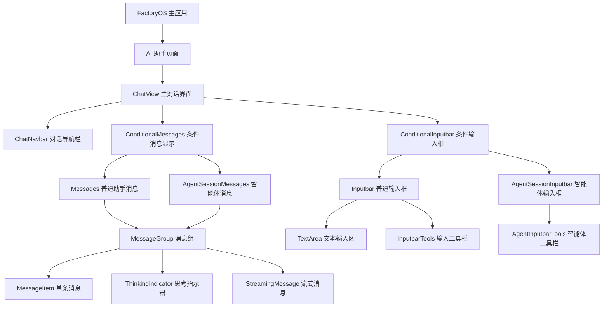
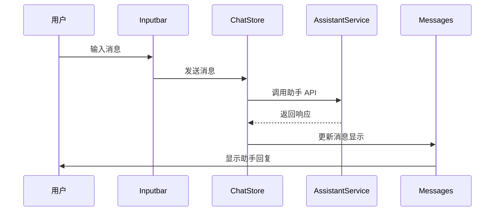
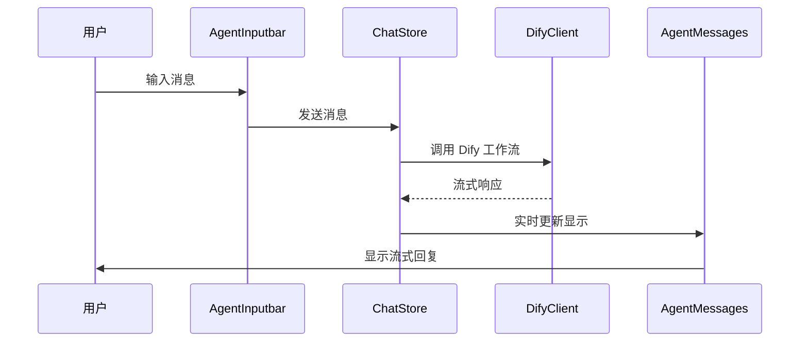

# FactoryOS 对话界面设计文档

## 概述

基于 Cherry Studio 的对话界面架构，为 FactoryOS 设计统一的 AI 对话界面。该界面将支持与普通助手和 Dify 智能体的对话，提供流畅的用户体验和强大的交互功能。

## 架构设计

### 整体架构图



### 核心组件架构

#### 1. ChatView.vue - 主对话界面

**文件位置**: `apps/web-antd/src/views/ai-chat/ChatView.vue`

**功能职责**:

- 作为对话界面的主容器组件
- 根据当前对话类型动态渲染不同的消息和输入组件
- 管理对话状态和导航
- 处理键盘快捷键和界面交互

**核心逻辑**:

```typescript
// 判断对话类型并渲染相应组件
const activeChat = computed(() => {
  return assistantsStore.activeAssistant;
});

const chatType = computed(() => {
  return activeChat.value?.type === 'agent' ? 'session' : 'topic';
});
```

#### 2. Messages.vue - 普通助手消息组件

**文件位置**: `apps/web-antd/src/views/ai-chat/components/Messages.vue`

**功能职责**:

- 显示与普通助手的对话消息
- 支持消息分组和无限滚动
- 处理消息的展开/折叠状态
- 支持消息的复制、删除等操作

**核心特性**:

- 按用户问题分组消息
- 支持 Markdown 渲染
- 图片和文件预览
- 消息时间戳显示

#### 3. AgentSessionMessages.vue - 智能体消息组件

**文件位置**: `apps/web-antd/src/views/ai-chat/components/AgentSessionMessages.vue`

**功能职责**:

- 显示与智能体的对话消息
- 处理 Dify 工作流的流式响应
- 显示智能体状态和思考过程
- 支持工作流执行状态的实时更新

**核心特性**:

- 流式消息实时显示
- 工作流步骤可视化
- 错误状态和重试机制
- 智能体健康状态指示

#### 4. Inputbar.vue - 普通输入框组件

**文件位置**: `apps/web-antd/src/views/ai-chat/components/Inputbar.vue`

**功能职责**:

- 提供文本输入界面
- 支持快捷命令和文件上传
- 显示上下文信息和知识库选择
- 处理消息发送逻辑

**核心特性**:

- 自动调整高度的文本框
- 快捷命令触发 (`/`)
- 模型提及功能 (`@`)
- 文件拖拽上传
- Token 计数显示

#### 5. AgentSessionInputbar.vue - 智能体输入框组件

**文件位置**: `apps/web-antd/src/views/ai-chat/components/AgentSessionInputbar.vue`

**功能职责**:

- 提供智能体对话的输入界面
- 处理 Dify 工作流的消息发送
- 支持中断正在进行的流式响应
- 显示智能体配置和工作流信息

**核心特性**:

- 流式响应中断控制
- 工作流参数输入
- 智能体状态显示
- 历史对话上下文

## 详细组件设计

### ChatNavbar.vue - 对话导航栏

```typescript
interface ChatNavbarProps {
  assistant: Assistant | Agent;
  onBack: () => void;
  onSettings: () => void;
}

// 功能包括：
// - 助手/智能体基本信息显示
// - 返回按钮
// - 设置按钮
// - 对话状态指示器
// - 连接状态显示
```

**核心功能**:

1. **信息显示**: 显示当前助手/智能体的名称、头像、状态
2. **导航控制**: 返回助手列表、进入设置页面
3. **状态指示**: 连接状态、响应状态、错误提示
4. **快速操作**: 新建对话、清空历史、导出对话

### Messages.vue - 消息显示组件

```typescript
interface MessageGroup {
  id: string;
  userMessage: Message;
  assistantMessages: Message[];
  timestamp: Date;
  status: 'success' | 'error' | 'streaming';
}

// 消息渲染策略：
// 1. 按用户输入分组
// 2. 支持多个模型同时响应
// 3. 流式消息实时更新
// 4. 错误状态处理
```

**核心功能**:

1. **消息分组**: 按用户问题将相关消息分组显示
2. **无限滚动**: 支持大量历史消息的流畅滚动
3. **消息渲染**: Markdown、代码高亮、图片预览
4. **交互操作**: 复制、编辑、删除、重新生成
5. **状态管理**: 加载状态、错误状态、流式更新

### AgentSessionMessages.vue - 智能体消息组件

```typescript
interface AgentMessage extends Message {
  workflowStep?: string;
  stepStatus?: 'pending' | 'running' | 'completed' | 'error';
  thinkingProcess?: string[];
  difyMetadata?: {
    workflowId: string;
    runId: string;
    tokens: number;
  };
}
```

**核心功能**:

1. **流式响应**: 实时显示 Dify 工作流的响应
2. **工作流可视化**: 显示工作流执行步骤和状态
3. **思考过程**: 展示智能体的推理过程
4. **错误处理**: 工作流失败时的错误显示和重试
5. **上下文管理**: 维护智能体会话的上下文信息

### Inputbar.vue - 普通输入框

```typescript
interface InputbarState {
  text: string;
  height: number;
  isFullscreen: boolean;
  attachedFiles: File[];
  selectedKnowledgeBases: KnowledgeBase[];
  mentionedModels: Model[];
  tokenCount: number;
}
```

**核心功能**:

1. **智能输入**: 自动调整高度、快捷命令支持
2. **文件处理**: 拖拽上传、图片粘贴、文件管理
3. **上下文控制**: 知识库选择、模型提及
4. **发送控制**: 快捷键发送、发送频率限制
5. **工具集成**: 图片识别、文件预览、历史记录

### AgentSessionInputbar.vue - 智能体输入框

```typescript
interface AgentInputbarState {
  text: string;
  isStreaming: boolean;
  canAbort: boolean;
  workflowInputs: Record<string, any>;
  sessionContext: SessionContext;
}
```

**核心功能**:

1. **流式控制**: 中断正在进行的响应
2. **工作流输入**: 支持复杂的工作流参数输入
3. **会话管理**: 维护智能体会话状态
4. **上下文显示**: 显示相关的上下文信息
5. **错误恢复**: 连接失败时的重试机制

## 状态管理设计

### Chat Store 结构

```typescript
// packages/stores/src/chat.ts
interface ChatState {
  // 当前对话状态
  activeAssistantId: string | null;
  activeTopicId: string | null;
  activeSessionId: string | null;

  // 消息数据
  messages: Record<string, Message[]>;
  messageGroups: Record<string, MessageGroup[]>;

  // 对话历史
  topics: Record<string, Topic>;
  sessions: Record<string, AgentSession>;

  // UI 状态
  scrollPosition: Record<string, number>;
  isStreaming: boolean;
  error: string | null;
}
```

### 消息数据模型

```typescript
// packages/types/src/chat.ts
interface Message {
  id: string;
  role: 'user' | 'assistant' | 'system';
  content: string;
  timestamp: Date;

  // 普通助手消息
  model?: string;
  temperature?: number;
  tokens?: number;

  // 智能体消息
  workflowId?: string;
  runId?: string;
  stepName?: string;
  thinkingProcess?: string[];

  // 通用属性
  files?: Attachment[];
  metadata?: Record<string, any>;
  status: 'sent' | 'received' | 'error' | 'streaming';
}
```

## 交互流程设计

### 普通助手对话流程



### 智能体对话流程



## 性能优化策略

### 1. 虚拟滚动优化

```typescript
// apps/web-antd/src/composables/useVirtualMessages.ts
export function useVirtualMessages(
  messages: Ref<Message[]>,
  containerHeight: number,
) {
  const visibleMessages = computed(() => {
    // 实现虚拟滚动逻辑
    // 只渲染可见区域的消息
  });

  return { visibleMessages };
}
```

### 2. 消息缓存策略

```typescript
// 本地缓存最近的消息
// 按需加载历史消息
// 智能预加载下一页消息
```

### 3. 流式响应优化

```typescript
// 使用 requestAnimationFrame 优化流式更新
// 批量处理消息更新
// 避免频繁的 DOM 操作
```

## 错误处理机制

### 1. 网络错误处理

```typescript
// 自动重试机制
// 离线模式支持
// 错误状态显示
```

### 2. 消息发送失败

```typescript
// 本地暂存失败消息
// 提供重发选项
// 网络恢复后自动重试
```

### 3. 智能体连接失败

```typescript
// 健康检查机制
// 降级到基础模式
// 错误恢复指导
```

## 主题和样式设计

### 1. 响应式布局

```scss
.chat-container {
  display: flex;
  flex-direction: column;
  height: 100vh;

  .chat-navbar {
    height: 60px;
    flex-shrink: 0;
  }

  .messages-container {
    flex: 1;
    overflow-y: auto;
  }

  .inputbar-container {
    min-height: 60px;
    max-height: 50vh;
    flex-shrink: 0;
  }
}
```

### 2. 主题适配

```typescript
// 支持亮色/暗色主题
// 自定义消息气泡样式
// 动画和过渡效果
```

## 测试策略

### 1. 单元测试

- 消息组件渲染测试
- 输入框功能测试
- 状态管理测试

### 2. 集成测试

- 对话流程测试
- API 集成测试
- 错误处理测试

### 3. E2E 测试

- 完整对话流程测试
- 跨浏览器兼容性测试
- 性能测试

## 总结

FactoryOS 的对话界面设计充分考虑了用户体验和技术实现的平衡，通过模块化的组件架构和灵活的状态管理，为用户提供了强大而易用的 AI 对话体验。同时，针对工厂场景的特殊需求，设计了专门的智能体交互模式，确保 Dify 工作流的流畅集成。
