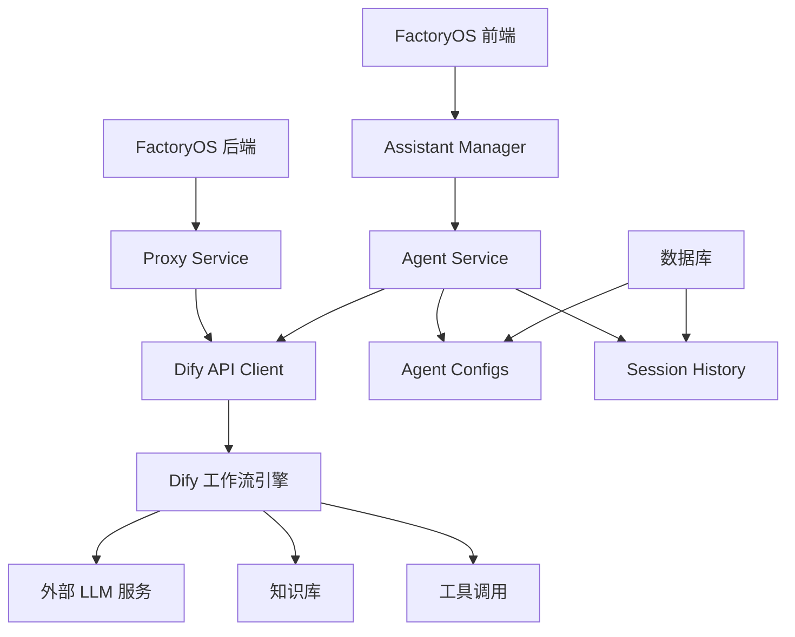

# Dify 工作流集成方案

## 概述

本文档详细描述了如何在 FactoryOS 的助手和智能体管理系统中集成 Dify 工作流功能。通过 Dify 的可视化工作流编排能力，可以为工厂管理系统提供强大的 AI 自动化解决方案。

## Dify 平台介绍

Dify 是一个开源的 LLM 应用开发平台，提供：

- **可视化工作流编排**: 拖拽式的工作流设计界面
- **多模型支持**: 集成各种主流 LLM 服务
- **API 接口**: 提供标准的 RESTful API
- **企业级功能**: 权限管理、监控、日志等

## 集成架构设计

### 架构图



### 核心组件

1. **Agent Service**: 智能体服务，负责与 Dify API 通信
2. **Dify API Client**: Dify API 的客户端封装
3. **Proxy Service**: 后端代理服务，处理 API 密钥和安全
4. **Health Check Service**: 健康检查服务，监控 Dify 连接状态

## Dify API 集成实现

### 1. API 客户端设计

```typescript
// apps/web-antd/src/services/dify-client.ts
export class DifyApiClient {
  private baseUrl: string;
  private apiKey: string;
  private timeout: number = 30000;

  constructor(config: DifyConfig) {
    this.baseUrl = config.apiUrl.replace(/\/$/, '');
    this.apiKey = config.apiKey;
  }

  // 工作流对话接口
  async chat(workflowId: string, message: string, conversationId?: string) {
    return this.streamRequest('/chat-messages', {
      inputs: {},
      query: message,
      response_mode: 'streaming',
      conversation_id: conversationId,
      user: this.getUserId(),
    });
  }

  // 工作流运行接口
  async runWorkflow(workflowId: string, inputs: Record<string, any>) {
    return this.request('/workflows/run', {
      inputs,
      response_mode: 'blocking',
      user: this.getUserId(),
    });
  }

  // 获取工作流信息
  async getWorkflow(workflowId: string) {
    return this.request(`/workflows/${workflowId}`);
  }

  // 流式请求处理
  private async streamRequest(endpoint: string, data: any) {
    const response = await fetch(`${this.baseUrl}${endpoint}`, {
      method: 'POST',
      headers: {
        Authorization: `Bearer ${this.apiKey}`,
        'Content-Type': 'application/json',
      },
      body: JSON.stringify(data),
    });

    if (!response.ok) {
      throw new DifyApiError(response.statusText, response.status);
    }

    return this.parseSSEStream(response);
  }

  // SSE 流解析
  private async *parseSSEStream(response: Response) {
    const reader = response.body?.getReader();
    const decoder = new TextDecoder();

    if (!reader) throw new Error('无法读取响应流');

    while (true) {
      const { done, value } = await reader.read();
      if (done) break;

      const chunk = decoder.decode(value);
      const lines = chunk.split('\n');

      for (const line of lines) {
        if (line.startsWith('data: ')) {
          const data = line.slice(6);
          if (data === '[DONE]') return;

          try {
            const parsed = JSON.parse(data);
            yield parsed;
          } catch (e) {
            console.warn('解析 SSE 数据失败:', data);
          }
        }
      }
    }
  }
}
```

### 2. 错误处理和重试机制

```typescript
// apps/web-antd/src/services/dify-error-handler.ts
export class DifyApiError extends Error {
  constructor(
    message: string,
    public statusCode: number,
    public errorCode?: string,
  ) {
    super(message);
    this.name = 'DifyApiError';
  }
}

export class DifyErrorHandler {
  private maxRetries = 3;
  private retryDelay = 1000;

  async executeWithRetry<T>(
    operation: () => Promise<T>,
    context: string,
  ): Promise<T> {
    let lastError: Error;

    for (let attempt = 1; attempt <= this.maxRetries; attempt++) {
      try {
        return await operation();
      } catch (error) {
        lastError = error;

        if (!this.shouldRetry(error) || attempt === this.maxRetries) {
          throw this.enhanceError(error, context, attempt);
        }

        await this.delay(this.retryDelay * attempt);
      }
    }

    throw lastError!;
  }

  private shouldRetry(error: any): boolean {
    if (error instanceof DifyApiError) {
      // 网络错误、超时、服务器错误可以重试
      return (
        error.statusCode >= 500 ||
        error.statusCode === 429 ||
        error.statusCode === 0
      );
    }

    // 网络错误
    return error.name === 'TypeError' || error.message.includes('fetch');
  }

  private enhanceError(error: Error, context: string, attempt: number): Error {
    const enhancedError = new Error(
      `${context} 失败 (尝试 ${attempt} 次): ${error.message}`,
    );
    enhancedError.name = error.name;
    enhancedError.stack = error.stack;
    return enhancedError;
  }

  private delay(ms: number): Promise<void> {
    return new Promise((resolve) => setTimeout(resolve, ms));
  }
}
```

### 3. 智能体服务实现

```typescript
// apps/web-antd/src/services/agent-service.ts
export class AgentService {
  private difyClient: DifyApiClient;
  private errorHandler: DifyErrorHandler;
  private healthChecker: AgentHealthChecker;

  constructor(private config: AgentConfig) {
    this.difyClient = new DifyApiClient(config.difyConfig);
    this.errorHandler = new DifyErrorHandler();
    this.healthChecker = new AgentHealthChecker(this.difyClient);
  }

  // 发送消息到智能体
  async sendMessage(
    message: string,
    conversationId?: string,
    onMessage?: (message: any) => void,
  ): Promise<string> {
    return this.errorHandler.executeWithRetry(async () => {
      const conversation = await this.getOrCreateConversation(conversationId);

      let finalAnswer = '';

      try {
        for await (const chunk of this.difyClient.chat(
          this.config.difyConfig.workflowId!,
          message,
          conversation.id,
        )) {
          if (onMessage) {
            onMessage(chunk);
          }

          if (chunk.answer) {
            finalAnswer += chunk.answer;
          }
        }

        // 更新对话状态
        await this.updateConversation(conversation.id, {
          lastMessage: message,
          lastResponse: finalAnswer,
          updatedAt: new Date(),
        });

        return finalAnswer;
      } catch (error) {
        // 记录错误状态
        await this.updateConversation(conversation.id, {
          error: error.message,
          updatedAt: new Date(),
        });
        throw error;
      }
    }, '智能体对话');
  }

  // 运行工作流
  async runWorkflow(inputs: Record<string, any>): Promise<any> {
    return this.errorHandler.executeWithRetry(async () => {
      return await this.difyClient.runWorkflow(
        this.config.difyConfig.workflowId!,
        inputs,
      );
    }, '工作流执行');
  }

  // 获取或创建对话
  private async getOrCreateConversation(conversationId?: string) {
    // 实现对话管理逻辑
    // 这里需要根据具体的存储方案实现
  }

  // 健康检查
  async checkHealth(): Promise<HealthStatus> {
    return this.healthChecker.check();
  }
}
```

## 健康检查和监控

### 1. 健康检查服务

```typescript
// apps/web-antd/src/services/agent-health-checker.ts
export interface HealthStatus {
  isHealthy: boolean;
  lastCheck: Date;
  responseTime: number;
  error?: string;
  details?: {
    apiAccessible: boolean;
    workflowExists: boolean;
    averageResponseTime: number;
  };
}

export class AgentHealthChecker {
  private checkInterval: NodeJS.Timeout | null = null;
  private healthHistory: HealthStatus[] = [];

  constructor(private difyClient: DifyApiClient) {}

  startPeriodicCheck(intervalMs: number = 60000) {
    this.stopPeriodicCheck();

    this.checkInterval = setInterval(async () => {
      await this.check();
    }, intervalMs);
  }

  stopPeriodicCheck() {
    if (this.checkInterval) {
      clearInterval(this.checkInterval);
      this.checkInterval = null;
    }
  }

  async check(): Promise<HealthStatus> {
    const startTime = Date.now();

    try {
      // 检查 API 可访问性
      const apiResponse = await this.difyClient.getHealth();
      const apiAccessible = apiResponse.status === 'ok';

      // 检查工作流存在性
      const workflowExists = await this.checkWorkflowExists();

      const responseTime = Date.now() - startTime;
      const isHealthy = apiAccessible && workflowExists;

      const status: HealthStatus = {
        isHealthy,
        lastCheck: new Date(),
        responseTime,
        details: {
          apiAccessible,
          workflowExists,
          averageResponseTime: this.calculateAverageResponseTime(responseTime),
        },
      };

      this.healthHistory.push(status);
      if (this.healthHistory.length > 10) {
        this.healthHistory.shift();
      }

      return status;
    } catch (error) {
      const status: HealthStatus = {
        isHealthy: false,
        lastCheck: new Date(),
        responseTime: Date.now() - startTime,
        error: error.message,
      };

      this.healthHistory.push(status);
      return status;
    }
  }

  private async checkWorkflowExists(): Promise<boolean> {
    try {
      await this.difyClient.getWorkflow('default');
      return true;
    } catch {
      return false;
    }
  }

  private calculateAverageResponseTime(newTime: number): number {
    const recentTimes = this.healthHistory
      .slice(-5)
      .map((h) => h.responseTime)
      .concat(newTime);

    return (
      recentTimes.reduce((sum, time) => sum + time, 0) / recentTimes.length
    );
  }
}
```

## 数据模型设计

### 1. 智能体配置模型

```typescript
// packages/types/src/ai-agents.ts
export interface AgentConfig {
  id: string;
  name: string;
  description?: string;
  avatar?: string;
  type: 'agent';

  // Dify 配置
  difyConfig: {
    apiUrl: string;
    apiKey: string;
    workflowId?: string;
    timeout: number;
  };

  // 运行时配置
  runtimeConfig: {
    maxRetries: number;
    retryDelay: number;
    healthCheckInterval: number;
  };

  // 状态信息
  status: 'online' | 'offline' | 'error' | 'checking';
  lastHealthCheck?: Date;
  healthHistory: HealthStatus[];

  // 元数据
  tags: string[];
  groupId?: string;
  createdAt: Date;
  updatedAt: Date;
  createdBy: string;
}

export interface AgentConversation {
  id: string;
  agentId: string;
  userId: string;
  title: string;
  messages: AgentMessage[];
  status: 'active' | 'archived' | 'error';
  lastActivity: Date;
  createdAt: Date;
}

export interface AgentMessage {
  id: string;
  role: 'user' | 'assistant' | 'system';
  content: string;
  timestamp: Date;
  metadata?: {
    tokens?: number;
    responseTime?: number;
    workflowRunId?: string;
  };
}
```

## 安全考虑

### 1. API 密钥管理

```typescript
// apps/web-antd/src/services/api-key-manager.ts
export class ApiKeyManager {
  private storageKey = 'dify_api_keys';

  // 加密存储 API 密钥
  async storeApiKey(agentId: string, apiKey: string): Promise<void> {
    const encryptedKey = await this.encrypt(apiKey);
    const keys = this.getAllApiKeys();
    keys[agentId] = encryptedKey;
    localStorage.setItem(this.storageKey, JSON.stringify(keys));
  }

  // 获取解密的 API 密钥
  async getApiKey(agentId: string): Promise<string | null> {
    const keys = this.getAllApiKeys();
    const encryptedKey = keys[agentId];
    if (!encryptedKey) return null;

    return this.decrypt(encryptedKey);
  }

  // 删除 API 密钥
  removeApiKey(agentId: string): void {
    const keys = this.getAllApiKeys();
    delete keys[agentId];
    localStorage.setItem(this.storageKey, JSON.stringify(keys));
  }

  private async encrypt(text: string): Promise<string> {
    // 使用 Web Crypto API 加密
    const encoder = new TextEncoder();
    const data = encoder.encode(text);

    const key = await this.getEncryptionKey();
    const encrypted = await crypto.subtle.encrypt(
      { name: 'AES-GCM', iv: crypto.getRandomValues(new Uint8Array(12)) },
      key,
      data,
    );

    return btoa(String.fromCharCode(...new Uint8Array(encrypted)));
  }

  private async decrypt(encryptedText: string): Promise<string> {
    // 解密实现
  }

  private async getEncryptionKey(): Promise<CryptoKey> {
    // 获取或生成加密密钥
  }
}
```

### 2. 代理服务

```typescript
// backend-mock/src/routes/dify-proxy.ts
export function setupDifyProxy(router: Router) {
  router.post('/api/dify/:agentId/*', async (c) => {
    const agentId = c.req.param('agentId');
    const path = c.req.param('*');

    // 验证用户权限
    const user = await authenticateUser(c);
    if (!user.hasPermission('agent:use', agentId)) {
      return c.json({ error: '权限不足' }, 403);
    }

    // 获取智能体配置
    const agent = await getAgentConfig(agentId);
    if (!agent) {
      return c.json({ error: '智能体不存在' }, 404);
    }

    // 代理请求到 Dify
    const difyUrl = `${agent.difyConfig.apiUrl}/${path}`;
    const response = await fetch(difyUrl, {
      method: c.req.method,
      headers: {
        ...c.req.headers,
        Authorization: `Bearer ${agent.difyConfig.apiKey}`,
        'X-Forwarded-For': c.req.header('x-forwarded-for'),
      },
      body: c.req.body,
    });

    return response.body;
  });
}
```

## 工厂场景应用示例

### 1. 生产调度智能体

```typescript
// 生产调度工作流配置
const productionSchedulerAgent: AgentConfig = {
  name: '生产调度助手',
  description: '基于实时数据进行生产计划调度',
  difyConfig: {
    apiUrl: 'https://api.dify.ai/v1',
    apiKey: 'encrypted-api-key',
    workflowId: 'prod-scheduler-workflow',
    timeout: 60000,
  },
  runtimeConfig: {
    maxRetries: 3,
    retryDelay: 2000,
    healthCheckInterval: 30000,
  },
};

// 使用示例
const schedulerService = new AgentService(productionSchedulerAgent);

// 获取生产建议
const suggestions = await schedulerService.runWorkflow({
  currentOrders: getCurrentOrders(),
  machineStatus: getMachineStatus(),
  materialInventory: getMaterialInventory(),
  workforce: getWorkforceAvailability(),
});
```

### 2. 质量检测智能体

```typescript
// 质量检测工作流配置
const qualityInspectorAgent: AgentConfig = {
  name: '质量检测助手',
  description: '分析产品质量数据并提供建议',
  difyConfig: {
    apiUrl: 'https://api.dify.ai/v1',
    apiKey: 'encrypted-api-key',
    workflowId: 'quality-inspection-workflow',
    timeout: 45000,
  },
};

// 质量检测对话
const qualityAnalysis = await qualityInspectorService.sendMessage(
  '检测到产品A出现异常质量波动，请分析原因并提供改进建议',
  conversationId,
  (message) => {
    console.log('质量分析结果:', message.answer);
  },
);
```

## 性能优化建议

### 1. 连接池管理

```typescript
// Dify 连接池
export class DifyConnectionPool {
  private connections = new Map<string, DifyApiClient>();
  private maxConnections = 10;

  async getConnection(config: DifyConfig): Promise<DifyApiClient> {
    const key = `${config.apiUrl}:${config.workflowId}`;

    if (this.connections.has(key)) {
      return this.connections.get(key)!;
    }

    if (this.connections.size >= this.maxConnections) {
      // 清理最旧的连接
      const oldestKey = this.connections.keys().next().value;
      this.connections.delete(oldestKey);
    }

    const client = new DifyApiClient(config);
    this.connections.set(key, client);
    return client;
  }
}
```

### 2. 智能缓存

```typescript
// 响应缓存
export class DifyResponseCache {
  private cache = new Map<string, CachedResponse>();
  private ttl = 5 * 60 * 1000; // 5分钟

  async get(key: string): Promise<any | null> {
    const cached = this.cache.get(key);
    if (!cached) return null;

    if (Date.now() - cached.timestamp > this.ttl) {
      this.cache.delete(key);
      return null;
    }

    return cached.data;
  }

  set(key: string, data: any): void {
    this.cache.set(key, {
      data,
      timestamp: Date.now(),
    });
  }
}
```

## 总结

通过 Dify 工作流集成，FactoryOS 可以：

1. **快速构建智能体**: 利用 Dify 的可视化工作流设计器
2. **灵活的业务逻辑**: 支持复杂的工厂业务场景
3. **统一的管理界面**: 在 FactoryOS 中统一管理所有智能体
4. **企业级可靠性**: 完善的错误处理、监控和安全机制

这个集成方案为工厂智能化管理提供了强大而灵活的技术基础。
